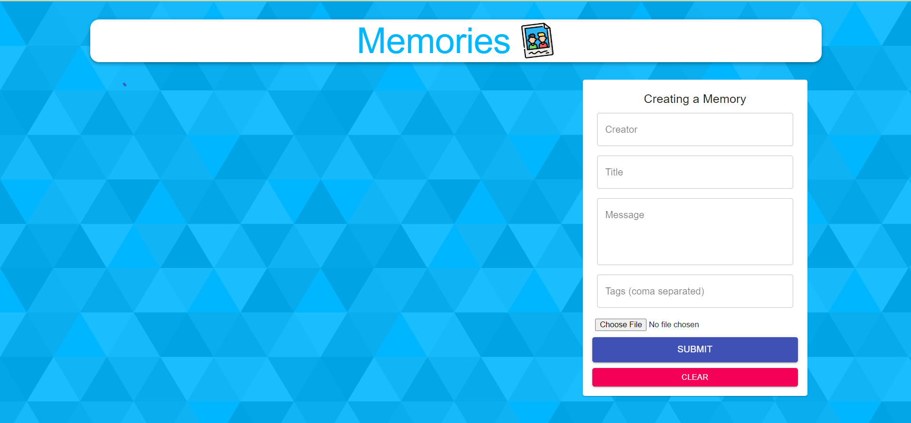
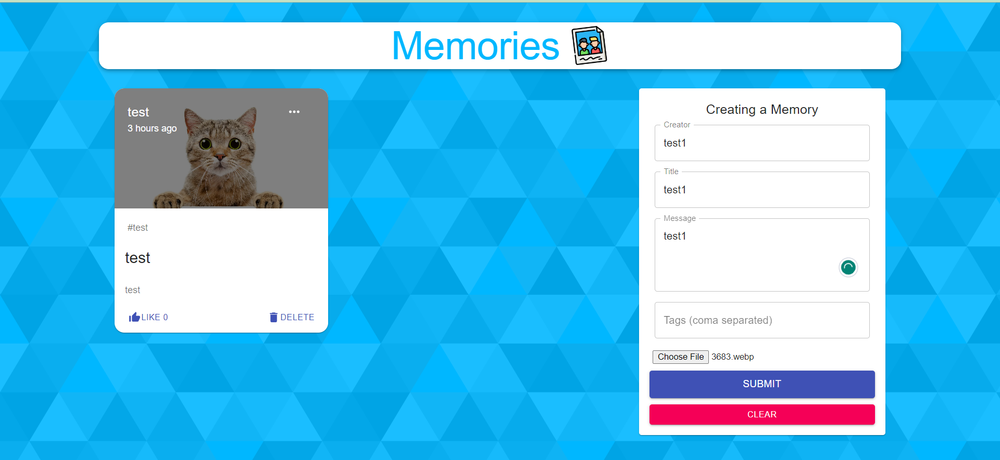
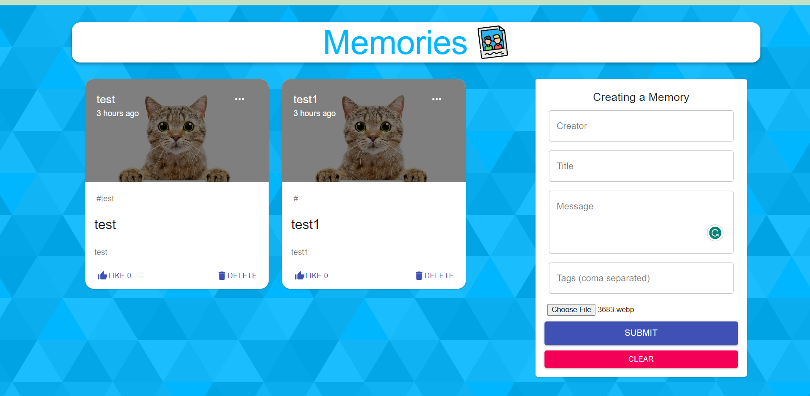
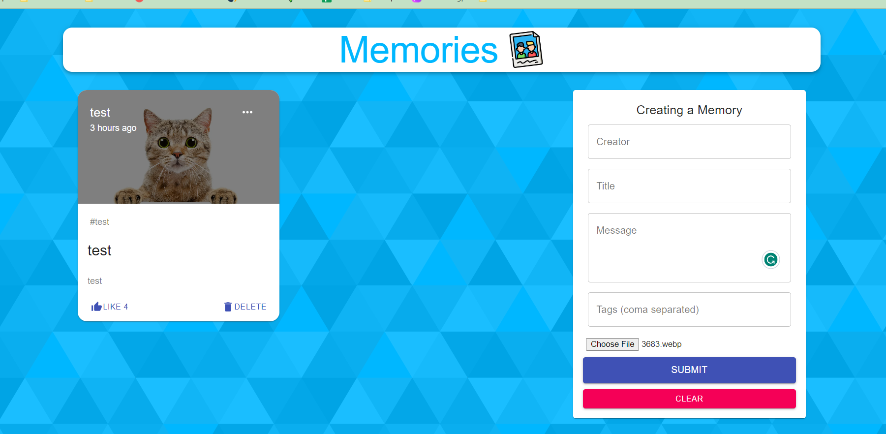
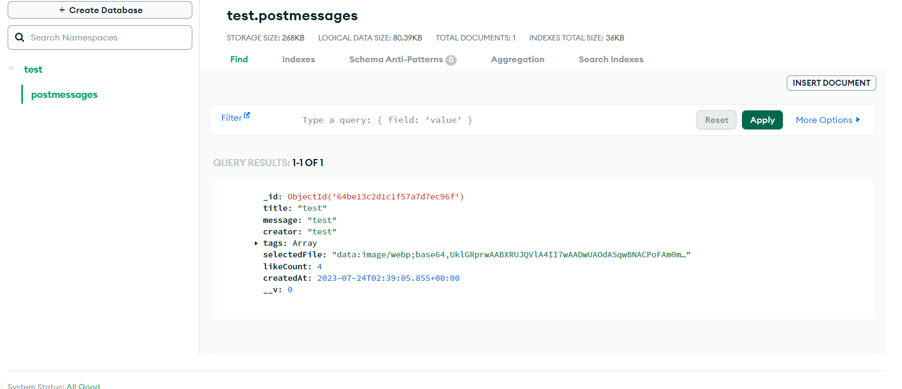

# Function
**crud** 

# Techstack
**MongoDb+Reactjs+Redux+MUI+Nodejs+Expressjs**

# Run in local enviroment

### git clone project
### npm i && npm start on both folder server and client 
### setup mongodb with your own 

# Then check it out 

